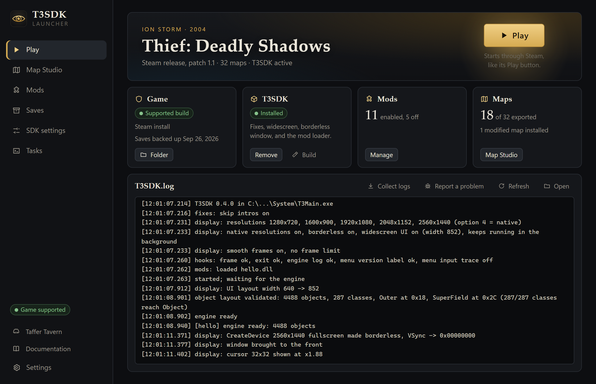
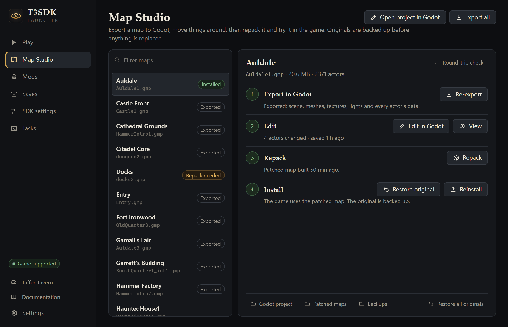

# Thief: Deadly Shadows modding SDK

[](https://discord.gg/hdAXH73tEG)
[](https://github.com/Veradictus/Thief3-Decomp/releases/latest)
[](https://veradictus.github.io/Thief3-Decomp/)

**T3SDK** is a modding SDK for **Thief: Deadly Shadows** (Ion Storm, 2004), PC.
It fixes the PC version's display problems, loads mods into your installed
copy of the game, and gives them access to the engine. The goal is mods as
large as multiplayer. It comes with a launcher, tools to edit maps in Godot,
and the workbench for a matching decompilation of the game.



**Documentation**: <https://veradictus.github.io/Thief3-Decomp/>, with the
player guide, the mod author guide, the API reference and the engineering
notes (the same pages as in [docs/](docs/)).

**What do you want to do?**

- [Play with the fixes and mods](#quick-start): download the launcher, click Install, click Play.
- [Edit maps](#edit-maps): export a map to Godot, change it, put it back into the game.
- [Write a mod](#write-a-mod): a DLL with a small C API.
- [Help decompile the game](#reverse-engineering-workbench-and-matching-decompilation).

## Quick start

1. Own **Thief: Deadly Shadows on Steam** ([buy it](#buy-the-damn-game)),
   installed. The SDK supports the Steam release (patch 1.1).
2. Download the launcher from the
   [latest release](https://github.com/Veradictus/Thief3-Decomp/releases/latest):
   `T3SDK-Launcher_<version>_x64-setup.exe`, or the `_portable.zip` to unzip
   anywhere. Windows may warn about an unknown publisher (the installer is not
   code-signed): choose *More info*, then *Run anyway*.
3. Start **T3SDK Launcher**. It finds the game and its own tools by itself;
   when they show **OK**, click **Continue** (Godot is only needed to edit
   maps).
4. On the **Play** page, click **Install** in the T3SDK box, then **Play**.

That's all: the launcher brings its own copy of the tools and of Python. You
now have:

- no logo movies at start-up;
- your monitor's native resolution in Options;
- a borderless window instead of exclusive fullscreen (alt-tab, other
  monitors and screenshots work);
- menus laid out for widescreen;
- the mod loader: mod DLLs go into the game's `System\mods` folder
  (**Mods** page, **Open folder**).

Change any of it on the **SDK settings** page. **Remove** on the Play page
takes T3SDK out again and leaves the game as it was. More in
[docs/launcher.md](docs/launcher.md) and [docs/sdk.md](docs/sdk.md).

## Edit maps

Experimental: tested on synthetic maps; moving, rotating and scaling what is
already in a map and changing its properties works, adding and removing things
does not yet.

1. Install [Godot 4.7 or newer](https://godotengine.org/download/). The
   launcher usually finds it; otherwise set it under **Settings**.
2. In the launcher, open **Map Studio**, pick a map and click **Export**.
3. Click **Edit in Godot**. Move, rotate and scale things with Godot's tools,
   or change their properties in the **T3 Map** dock (below the Inspector).
   Then click **Save T3 edits** in that dock.
4. Back in Map Studio, click **Repack**, then **Install**, and play the map.
5. **Restore original** puts the unmodified map back. Every original is backed
   up once, before it is first replaced.



**View** opens a map in a fly-through viewer instead. How the maps are stored
and converted is in [docs/assets.md](docs/assets.md). What the tools extract
from your copy is for your own modding: don't share it.

## Buy the damn game

**BUY THE DAMN GAME. IT'S WORTH IT.**

And while you're at it, **buy the whole classic trilogy**:
[*Thief Gold*](https://store.steampowered.com/app/211600/),
[*Thief II: The Metal Age*](https://store.steampowered.com/app/211740/) and
[*Thief: Deadly Shadows*](https://store.steampowered.com/app/6980/). They're on
Steam, and they're on sale about half the time, so the lot costs less than a
fence would pay Garrett for a single candlestick.

Loved them? **Leave the classics a glowing review on Steam.** They've earned
it, and it helps the next taffer find them.

As for *Thief* (2014): we don't talk about *Thief* (2014). Its Garrett isn't
even voiced by Stephen Russell. If you've played it, you already know what to
write in your review. Honesty is a virtue, even among thieves.

Stealing is Garrett's job, not yours. Don't pirate the game, and don't share
its files, with this project or with anyone else. Only a taffer would.

T3SDK is not the game and contains none of it: no game code, no assets,
nothing you could play. It modifies a copy you own, in memory, while it runs.
Every copy sold tells whoever owns the series today that people still play
these games and care about them, and paying for the games we mod is how we
support the developers who make them.

The SDK supports the Steam release of Thief: Deadly Shadows (patch 1.1):
<https://store.steampowered.com/app/6980/>. Other releases are detected and
left untouched.

## Legal

- T3SDK is a fan project. It is not affiliated with or endorsed by Ion Storm,
  Eidos Interactive or the current owners of the Thief series. *Thief* and
  *Thief: Deadly Shadows* are trademarks of their respective owners and are
  used here only to name the game this software works with.
- The repository holds work written by its contributors: the SDK, the
  launcher, the tools, notes on how the game works (addresses, data layouts,
  file formats) so that mods can interoperate with it, and a matching
  decompilation: C++ source that the game's original compiler turns into the
  same machine code. It contains no files from the game, no game assets, no
  disassembly and no raw decompiler output, and the libraries the game links
  (Microsoft's runtime, D3DX, Havok) are not decompiled.
- The tools work on your own installed copy. What they produce from it
  (Ghidra databases, split objects, decompiler output, extracted assets) stays
  on your machine in ignored folders (`orig/`, `ghidra/`, `build/`). Don't
  commit or redistribute any of it; extracted assets are for your own modding.
- T3SDK does not circumvent copy protection and does not touch DRM components.
  On a Steam install, `tools/sdk.py run` starts the game through Steam, as the
  Play button does.
- The SDK changes the game only in memory while it runs. Installing it adds
  its own files to the game's `System/` folder, and removing it deletes
  exactly those. Installing an edited map replaces that one map, after the
  original is backed up.
- Content mods (texture packs and other file replacements) are applied the
  same way: the original files are kept in `System/mods/originals/` and put
  back when the mod is switched off.
- The software is provided as is, without warranty of any kind. Back up your
  saves before modding.

### License

Everything in this repository is under the [MIT license](LICENSE), including
the matching decompilation. The MIT license covers the contributors' own
work: the matching source is new code written to compile to the same machine
code, and it grants no rights to the game itself, its executable, its content
or its names, which stay with their owners. Building or using any of it needs
your own copy of the game. Third-party code we ship (MinHook in the SDK,
Python in the launcher) keeps its own license; see
[THIRD_PARTY_NOTICES.md](THIRD_PARTY_NOTICES.md). Security reports:
[SECURITY.md](SECURITY.md).

## Write a mod

A mod is a 32-bit DLL in `System/mods/` that exports `T3Mod_Init` and receives
the API table from [sdk/include/t3sdk/t3sdk.h](sdk/include/t3sdk/t3sdk.h):

```c
#include <t3sdk/t3sdk.h>

static const T3SdkApi* api;

static void T3SDK_CALL OnFrame(void* user) {
    if (api->EngineReady()) {
        /* read objects: api->ObjectCount(), api->FindObject("Class", "Engine.Actor"), ... */
    }
}

T3SDK_EXPORT int T3SDK_CALL T3Mod_Init(const T3SdkApi* sdk) {
    api = sdk;
    api->AddFrameCallback(OnFrame, NULL);
    api->Log("loaded");
    return 0;
}
```

`T3Mod_Init` runs before the engine starts, so do engine work from callbacks
once `EngineReady()` is true. [sdk/mods/hello](sdk/mods/hello/hello.cpp) is a
complete example, and [sdk/include/t3sdk/unreal.hpp](sdk/include/t3sdk/unreal.hpp)
has the engine's memory layouts for direct access. Build it as a 32-bit DLL
with any compiler, or along with the SDK (see [Build from source](#build-from-source)).
The settings, the fixes, the API's lifecycle and threading rules are in
[docs/sdk.md](docs/sdk.md). The site's
[mod author guide](https://veradictus.github.io/Thief3-Decomp/modding/first-mod)
goes from the mod template to a published `.t3mod` package.

The quickest start is [templates/mod](templates/mod/): copy it into a new
repository, set your mod's id and version, and CMake builds the DLL against
the SDK headers and packs a `.t3mod` that the launcher installs by drag and
drop. Its GitHub workflow attaches the package to a release when you push a
version tag, and the [mod index](modindex/) lists released mods in the
launcher's mod browser. The package format is [docs/mods.md](docs/mods.md);
`tools/t3mod.py` checks and packs packages by hand.

## Build from source

Every push builds the launcher (installer and portable zip) and the SDK on
GitHub Actions; they are the run's artifacts. Pushing a tag such as `v0.2.0`
publishes them as a release. To build locally:

| Part | Needs | Commands |
|---|---|---|
| SDK (`dinput8.dll`, example mod) | Windows, Python 3.10+, Visual Studio 2022+ with "Desktop development with C++" | see below |
| Launcher | Node 20+ (with `corepack enable`, for Yarn 4), Rust (stable); Linux also [Tauri's prerequisites](https://tauri.app/start/prerequisites/) | `cd launcher`, `yarn install`, `yarn tauri dev` |
| Map tools | Python 3.10+, Godot 4.7+ | `python tools/assets/t3map.py --all`, then `godot --path build/assets/godot` |
| Documentation site | Node 22.18+ (with `corepack enable`) | `cd site`, `yarn install`, `yarn docs:dev` ([docs/site.md](docs/site.md)) |

The SDK, from the repository's folder:

```sh
python -m venv .venv
.venv/Scripts/pip install -r requirements.txt

.venv/Scripts/python tools/sdk.py build     # dinput8.dll + example mod into build/sdk/bin/
.venv/Scripts/python tools/sdk.py deploy    # copy into the game's System/ folder
.venv/Scripts/python tools/sdk.py run       # start the game (through Steam)
.venv/Scripts/python tools/sdk.py log       # show System/T3SDK.log
.venv/Scripts/python tools/sdk.py undeploy  # remove everything deploy installed
```

The tools find the game through the registry entry its installer writes; pass
`--game-dir` (or set `T3_GAME_DIR`) to override it. The launcher also works
with a checkout: pick the repository's folder as the T3SDK folder in its
settings.

The SDK installs itself as `System/dinput8.dll`, which the game loads at
startup, and forwards DirectInput to the real system DLL. It does not replace
`d3d8.dll`, so it coexists with Sneaky Upgrade's Direct3D wrappers. To build a
mod along with the SDK, add a folder under `sdk/mods/` and list it in
`sdk/CMakeLists.txt`.

## Reverse-engineering workbench and matching decompilation

What the SDK hooks is found here, and the game is being decompiled function by
function into C++ that compiles back to the same bytes (a matching
decompilation, in `src/`). [docs/engine.md](docs/engine.md) collects the
engine addresses and layouts with their evidence, and
[docs/target.md](docs/target.md) describes the binary. Everything below runs on
your own copy of `T3Main.exe` and writes its results into ignored folders.

- **Ghidra**: `tools/ghidra_headless.py bootstrap` builds an analysed database
  in `ghidra/` (about 12 minutes; open `ghidra/T3Main.gpr` in the GUI).
  `tools/ghidra_headless.py script tools/ghidra/Decompile.java <addr>` prints
  the decompilation of a function; `refs:<addr>` prints the functions that
  reference an address.
- **Symbols**: `config/PC_20040610/symbols.txt` lists every function by address
  (dtk format) and is where names are recorded as they are identified;
  `tools/ghidra_headless.py names` applies them to the Ghidra database.
- **Split and diff**: `configure.py` plus `ninja` split `T3Main.exe` into
  objects with [delink](https://github.com/dbalatoni13/delink) and compare
  them with [objdiff](https://github.com/encounter/objdiff) against code
  compiled with the game's own compiler (MSVC 7.1), to check how a function was
  compiled. It needs `msvcr71.dll` and `msvcp71.dll`
  (`configure.py --msvc-runtime <folder>`), which many games from 2003-2006
  ship with. On Linux and macOS the compiler runs through
  [wibo](https://github.com/decompals/wibo) instead.
- **Matching**: `tools/agent/` is the per-function loop used by people and AI
  agents alike (claim a function, get its context, try a candidate, pass the
  strict gate); see [docs/matching.md](docs/matching.md). Progress is published
  on [decomp.dev](https://decomp.dev) by CI
  ([docs/decomp-dev.md](docs/decomp-dev.md)).

## Contributing

Questions, ideas, or want to help? Come to the
[Taffer Tavern on Discord](https://discord.gg/hdAXH73tEG).

Read [CONTRIBUTING.md](CONTRIBUTING.md) first. Commit messages follow
Conventional Commits, and there are hard rules about what may enter the
repository.

## Layout

```
sdk/                     the SDK: loader (dinput8.dll), public headers, example mods, MinHook
launcher/                the desktop launcher (Tauri: Rust backend, Svelte UI)
tools/sdk.py             build / deploy / run / drive the SDK
tools/stage_launcher.py  what the release launcher ships with (tools, SDK, Python)
tools/t3mod.py           check, pack and inspect .t3mod mod packages (tools/mods/: shared rules, fixtures)
tools/modindex.py        the mod index: validate, verify, build, add
templates/mod/           starter project for a mod: CMake, presets, packaging, release workflow
modindex/                the mod index: one file per published mod
tools/assets/            map and asset export to Godot, the viewer, the editor plugin, repacking
tools/ghidra/            Ghidra scripts (export, names, decompile, disassemble)
tools/agent/             the matching loop: work queue, context, try, accept, integrate
tools/                   split/diff pipeline and binary tools
src/, include/           the matching decompilation
config/PC_20040610/      symbols.txt, splits.txt
docs/                    engine notes, SDK and launcher guides, formats, matching, current status
site/                    the documentation site (VitePress) built from docs/
orig/PC_20040610/        your copy of T3Main.exe for the workbench (never committed)
.github/workflows/       CI: launcher and SDK builds, releases, the decomp.dev report, the docs site
```
